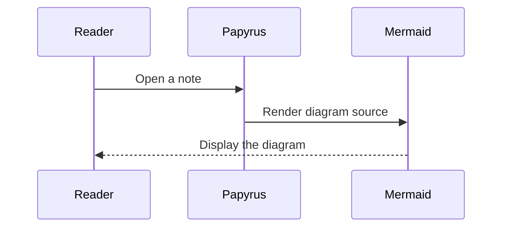
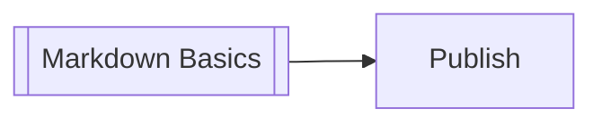

# Mermaid Diagrams

Papyrus follows Obsidian's Mermaid convention: place Mermaid syntax in a fenced code block whose identifier is exactly `mermaid`. The browser renders the fence as a diagram instead of showing it as source code.

````md

````


Flowcharts, sequence diagrams, class diagrams, state diagrams, entity-relationship diagrams, timelines, and the other diagram types included in Mermaid 11 are supported. Diagrams automatically use Mermaid's light or dark theme to match the active Papyrus theme. Invalid syntax produces a readable error with the original source so the note remains useful.

## Vault navigation

As in Obsidian, flowchart nodes with the `internal-link` class can open notes in the current vault. The node label is matched against note names, paths, and titles. Existing notes are pointer- and keyboard-accessible; unmatched labels remain visible but inactive.

````md

````


See the [Mermaid diagram syntax documentation](https://mermaid.js.org/intro/) for the complete language.

## Related reference notes

- [[reference/extensions/obsidian-syntax|Obsidian syntax and note features]]
- [[reference/markdown|Markdown code fences]]
