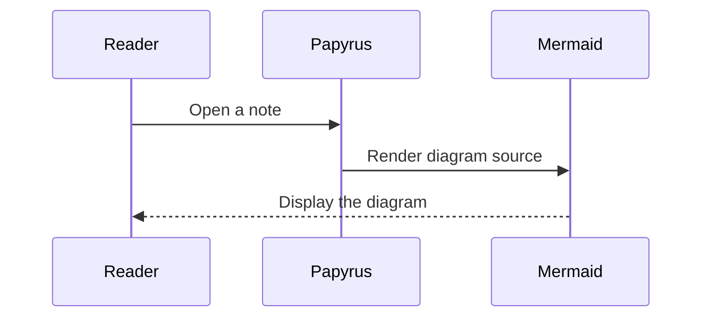
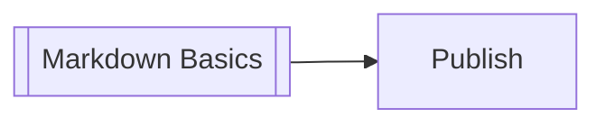

# Obsidian and Papyrus Extensions

Papyrus supports standard Markdown plus a few conventions that are useful for published vaults.

## Frontmatter

Frontmatter is metadata at the top of a note.

```md
---
title: Example Note
tags: papyrus, markdown
status: draft
---
```

Configured metadata appears in the reader panel and is included in search.

## Wiki links

Use Obsidian-style links to connect notes:

```md
[[workflow/setup]]
[[workflow/setup|Setup workflow]]
```

Papyrus resolves those links against the loaded vault and builds backlinks automatically.

## Markdown links to notes

Normal Markdown links to `.md` files can also resolve inside the app:

```md
[Markdown basics](../markdown.md)
```

## Math

Inline math such as $E = mc^2$ and block math are rendered with MathJax when present:

$$
\int_0^1 x^2\,dx = \frac{1}{3}
$$

## Mermaid diagrams

Papyrus follows Obsidian's Mermaid convention: place Mermaid syntax in a fenced code block whose identifier is exactly `mermaid`. The browser renders the fence as a diagram instead of showing it as source code.

````md

````


Flowcharts, sequence diagrams, class diagrams, state diagrams, entity-relationship diagrams, timelines, and the other diagram types included in Mermaid 11 are supported. Diagrams automatically use Mermaid's light or dark theme to match the active Papyrus theme. Invalid syntax produces a readable error with the original source so the note remains useful.

As in Obsidian, flowchart nodes with the `internal-link` class can open notes in the current vault. The node label is matched against note names, paths, and titles. Existing notes are pointer- and keyboard-accessible; unmatched labels remain visible but inactive.

````md

````


See the [Mermaid diagram syntax documentation](https://mermaid.js.org/intro/) for the complete language.

## Custom components

Papyrus uses the standard Markdown code-fence shape as its custom component contract. The fence identifier selects the component, and its body contains one `property: value` pair per line.

### Maps

A map is written as:

````md
```map
latitude: 60.1699
longitude: 24.9384
zoom: 11
marker: true
grayscale: true
label: Helsinki
```
````

| Property | Value | Behavior |
| --- | --- | --- |
| `latitude` | Number from `-90` to `90` | Sets the map center latitude. |
| `longitude` | Number from `-180` to `180` | Sets the map center longitude. |
| `zoom` | Number from `0` to `22` | Sets the initial zoom level. |
| `marker` | `true` or `false` | Places a marker at the configured latitude and longitude. Defaults to `false`. |
| `grayscale` | `true` or `false` | Filters the map canvas without filtering its markers. Defaults to `maps.grayscale` from the app configuration. |
| `label` | Plain text | Names the location in the component footer and labels its marker for assistive technology. |

Missing or out-of-range numeric properties use the fallback under `maps.fallback` in the active app configuration. The footer displays the label, current center coordinates, current zoom, a Google Maps link, and the fullscreen action. Its coordinates, zoom, and external link update as the reader moves the map.

MapLibre loads only when a note contains a map.

### Tickers

A ticker is a display-only market snapshot written with the same contract:

````md
```ticker
symbol: NOKIA
label: Nokia Oyj
market: Nasdaq Helsinki
quote: 4.67 EUR
change: +0.73% · illustrative
```
````

| Property | Value | Behavior |
| --- | --- | --- |
| `symbol` | Plain text | Shows the instrument ticker and supplies the preferred Google search term. |
| `label` | Plain text | Describes the instrument or company. Defaults to `symbol` when omitted. |
| `quote` | Plain text | Shows the price exactly as written, including any currency or unit. Defaults to an em dash. |
| `market` | Plain text | Names the marketplace, such as `NASDAQ` or `NYSE`. Defaults to the generic label `Market`. |
| `change` | Plain text | Optionally shows price development. A leading `+` or `↑` uses positive styling; a leading `-`, `−`, or `↓` uses negative styling; any other value is neutral. |

The full card links to a Google search for `stock ticker {symbol}` and opens it in a new tab. If `symbol` is missing, the component uses `label` as the search term. Papyrus does not fetch, validate, or refresh ticker values, so authors should identify delayed or illustrative quotes in their content when appropriate.

### SWOT analyses

A SWOT analysis uses one property for each factor:

````md
```swot
strengths: Strong customer retention and a focused product.
weaknesses: A small team with limited distribution.
opportunities: Growing demand in adjacent markets.
threats: Larger competitors entering the category.
```
````

| Property | Value | Behavior |
| --- | --- | --- |
| `strengths` | Plain text | Describes internal advantages in the Strengths quadrant. |
| `weaknesses` | Plain text | Describes internal limitations in the Weaknesses quadrant. |
| `opportunities` | Plain text | Describes external possibilities in the Opportunities quadrant. |
| `threats` | Plain text | Describes external risks in the Threats quadrant. |

The component always renders all four quadrants in SWOT order. Missing or empty values display an em dash. Values are display-only and appear exactly as written after surrounding whitespace is removed.

### Periodic tables

A periodic table is written with the `pte` identifier:

````md
```pte
label: Elements in caffeine
elements: H, C, N, O
```
````

| Property | Value | Behavior |
| --- | --- | --- |
| `label` | Plain text | Names the table for readers and assistive technology. Defaults to `Periodic table of elements`. |
| `elements` | Element symbols separated by commas, spaces, semicolons, or pipes | Highlights matching standard element symbols. Matching is case-insensitive, duplicates are collapsed, and unrecognized values are ignored. |

The component always renders all 118 elements in atomic-number order, with the lanthanides and actinides in separate rows. Each tile shows its atomic number, standard symbol, and name. When the component contains at least one recognized symbol, unselected elements are muted so the highlighted set stays prominent. On narrow screens the table scrolls horizontally rather than compressing its labels.

Every tile opens the configured element reference service in a new tab. Configure the service globally in `config/app-config.json`:

```json
"periodicTable": {
	"linkLabel": "PubChem",
	"linkTemplate": "https://pubchem.ncbi.nlm.nih.gov/element/{Z}"
}
```

`linkTemplate` accepts `{Z}` for the atomic number and `{symbol}` for the standard symbol. Papyrus substitutes every token that appears, so symbol-based services can use a template such as `https://example.com/elements/{symbol}`. An alternative atomic-number service is `https://www.rsc.org/periodic-table/element/{Z}`. The user-facing `linkLabel` identifies the selected service in the component header. External-link UTM configuration also applies to generated element links. See [[workflow/setup|Setup workflow]] for the runtime config files.

Only fences whose identifiers are exactly `map`, `ticker`, `swot`, or `pte` become Papyrus custom components. The Obsidian-compatible `mermaid` fence becomes a diagram. Ordinary fences such as `js`, `json`, and `md` continue to render as code. See [[reference/markdown|Markdown basics]] for normal code-block behavior.
